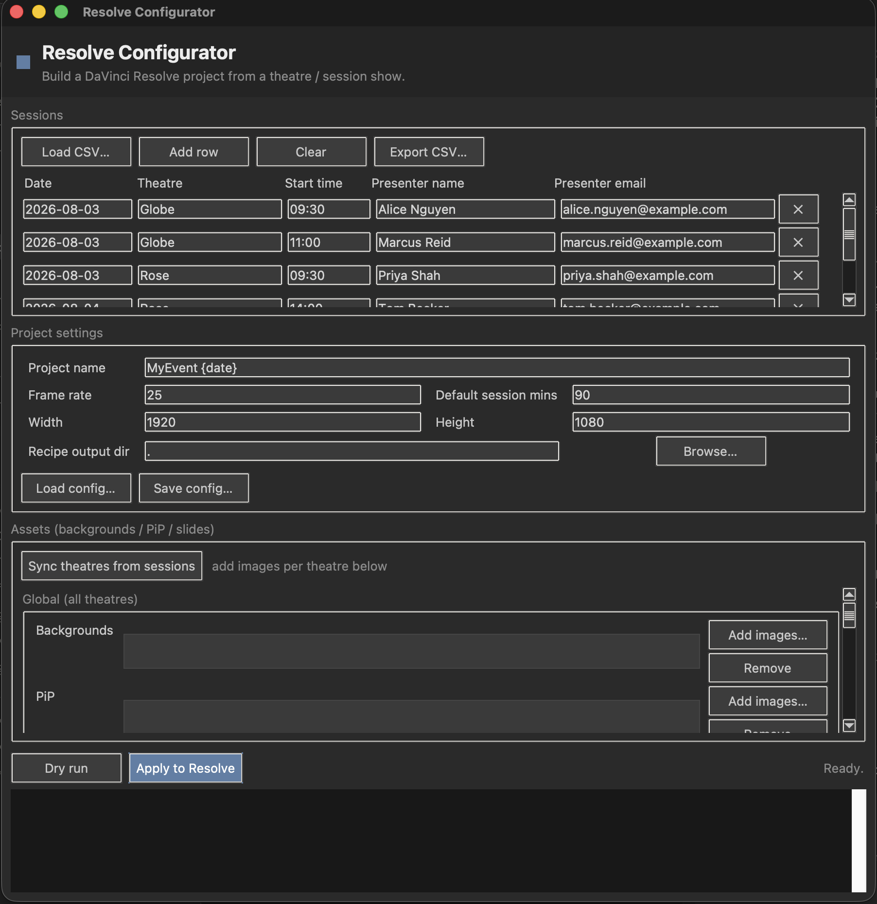
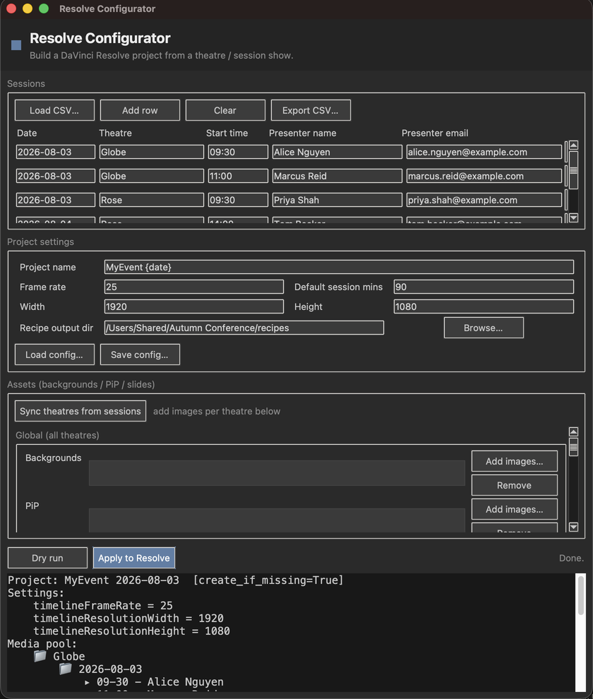

# Resolve Configurator

> **AI-assisted project.** This codebase was created with [Claude Code](https://claude.com/claude-code)
> (Anthropic), directed and reviewed by a human author — including the code, the docs, and the config.
> Review it yourself before relying on it in production, same as you would for any code.

Scaffold a **DaVinci Resolve** project for a multi-theatre event from the *same CSV* the
[nc-filedropbatch](https://github.com/stoatworks-labs/nc-filedropbatch) Nextcloud app uses to collect presenter
uploads. Point it at your sessions list plus a small config (frame rate, resolution, record-drive map, asset
manifest) and it builds:

- the **project format** — frame rate, resolution, and any other project setting you name;
- a **media-pool bin per theatre and per day** (`Theatre / Date`);
- an **empty timeline per session** inside each day's bin (`Start Time - Presenter`);
- prepopulated **backgrounds** (for PiP looks) and **holding/title slides**, global or per-theatre;
- a **smart-bin recipe** — the exact rule set to filter each day's recordings down to one session, by record
  drive, date, and timecode window.

The input CSV is unchanged from nc-filedropbatch:

```
Date, Theatre, Start Time, presenter name, presenter email
```

so the same show file drives both the upload side (Nextcloud) and the edit side (Resolve).

<!-- downloads:start -->

## Download

**[v0.1.4](https://github.com/stoatworks-labs/resolve-configurator/releases/tag/v0.1.4)** — prebuilt for macOS, Windows and Linux. Pick your platform:

<details>
<summary><b>macOS</b> — Apple Silicon</summary>

| Build | Download | Size |
| --- | --- | --- |
| Apple Silicon · .dmg disk image | [`resolve-configurator-0.1.4-macos-arm64.dmg`](https://github.com/stoatworks-labs/resolve-configurator/releases/download/v0.1.4/resolve-configurator-0.1.4-macos-arm64.dmg) | 19 MB |
| Apple Silicon · .pkg installer | [`resolve-configurator-0.1.4-macos-arm64.pkg`](https://github.com/stoatworks-labs/resolve-configurator/releases/download/v0.1.4/resolve-configurator-0.1.4-macos-arm64.pkg) | 9.8 MB |
| Apple Silicon · .zip archive | [`resolve-configurator-gui-macos-arm64.zip`](https://github.com/stoatworks-labs/resolve-configurator/releases/latest/download/resolve-configurator-gui-macos-arm64.zip) | 11 MB |

</details>

<details>
<summary><b>Windows</b> — x64</summary>

| Build | Download | Size |
| --- | --- | --- |
| x64 · .exe installer | [`resolve-configurator-0.1.4-windows-x64-setup.exe`](https://github.com/stoatworks-labs/resolve-configurator/releases/download/v0.1.4/resolve-configurator-0.1.4-windows-x64-setup.exe) | 11 MB |
| x64 · .zip archive | [`resolve-configurator-gui-windows-x64.zip`](https://github.com/stoatworks-labs/resolve-configurator/releases/latest/download/resolve-configurator-gui-windows-x64.zip) | 11 MB |

</details>

<details>
<summary><b>Linux</b> — x64</summary>

| Build | Download | Size |
| --- | --- | --- |
| x64 · .zip archive | [`resolve-configurator-gui-linux-x64.zip`](https://github.com/stoatworks-labs/resolve-configurator/releases/latest/download/resolve-configurator-gui-linux-x64.zip) | 24 MB |

</details>

Also in this release:

- [`resolve_configurator-0.1.4-py3-none-any.whl`](https://github.com/stoatworks-labs/resolve-configurator/releases/download/v0.1.4/resolve_configurator-0.1.4-py3-none-any.whl) — Python wheel (pip install), 53 KB
- [`resolve_configurator-0.1.4.tar.gz`](https://github.com/stoatworks-labs/resolve-configurator/releases/download/v0.1.4/resolve_configurator-0.1.4.tar.gz) — Source tarball, 56 KB

All builds, checksums and release notes: [github.com/stoatworks-labs/resolve-configurator/releases](https://github.com/stoatworks-labs/resolve-configurator/releases).

macOS builds are signed and notarised and open normally. The Windows builds are unsigned, so SmartScreen warns once — see [Windows SmartScreen](#windows-smartscreen) for the one-time click-through.

<!-- downloads:end -->

## The desktop app



*Edit sessions row by row (or Load a CSV), set the project format, then Sync theatres and browse background /
PiP / slide images per theatre. Grey-on-grey to match Resolve.*



*A Dry run previews the exact project format, media-pool bins, per-theatre asset bins, and per-session
timelines in the output pane before anything touches Resolve — real output on the bundled sample data.*

## Why a "recipe" and not real smart bins?

DaVinci Resolve's scripting API **cannot create smart bins** (confirmed for v20/v21 — you can create regular
bins, timelines, and import media, but smart-bin definitions are a UI/database artifact). And at build time the
recordings don't exist in the pool yet, so there are no clips to tag. So the tool builds everything the API
*can* do and writes a `smart-bins.md` / `smart-bins.json` with the precise rules to recreate each smart bin
once, by hand. Each session's rules are:

| Field | Operator | Value |
| --- | --- | --- |
| File Path | Contains | *record drive for the theatre* |
| Date Created | is | *session date* |
| Start TC | is in the range | *session start .. session end* |

The timecode window is **derived**: a session ends when the next one on that theatre/day starts; the last
session of the day uses `default_session_minutes`. Rules assume recorders are jammed to **time-of-day timecode**.

## Documentation

| Doc | Contents |
|---|---|
| [docs/USER-GUIDE.md](docs/USER-GUIDE.md) | Dry-running, derived session windows, the timecode assumption, troubleshooting |
| [docs/API.md](docs/API.md) | CLI flags, the full TOML schema, the shared CSV contract, naming rules, the recipe format |
| [docs/DEVELOPING.md](docs/DEVELOPING.md) | The two-repo CSV contract, the dry-run test pattern, deliberate behaviours |

## Requirements

- **Python 3.11+** (uses the stdlib `tomllib`; no third-party runtime dependencies).
- **DaVinci Resolve Studio** to apply a build to Resolve. External scripting is a *Studio* feature — the free
  version can only run scripts from Resolve's own **Workspace → Scripts** menu/Console.
- No Resolve at all is needed for `--dry-run`, which prints the full plan and still writes the recipe.

## Install

```
pip install -e .
```

Prebuilt **standalone GUI apps** (no Python needed) are attached to each
[GitHub Release](https://github.com/stoatworks-labs/resolve-configurator/releases): macOS (Apple Silicon),
Windows x64, and Linux x64, alongside the `wheel`/`sdist`. Intel-Mac users install via `pip`. The apps are
unsigned — see [Unsigned builds](#unsigned-builds--macos-gatekeeper--windows-smartscreen) for the fix.

## Use — external CLI (Studio)

```
resolve-configure sessions.csv --config project.toml
```

With Resolve running, this creates/loads the project, applies the settings, builds the bins/timelines, imports
the assets, and writes the recipe. Flags:

- `--dry-run` — never touch Resolve; print the planned tree and write the recipe. **Start here.**
- `--project-name NAME` — override `[project].name` from the config.
- `--recipe-out DIR` — where to write `smart-bins.md` / `smart-bins.json` (default: current dir).

Try it now, no Resolve needed:

```
resolve-configure sample-sessions.csv --config project.example.toml --dry-run --recipe-out out
```

## Use — desktop GUI

```
resolve-configure-gui
```

A Tkinter editor (styled grey-on-grey to sit next to Resolve) that builds the whole show without touching a
file by hand:

- **Sessions** — edit rows directly (Add row / delete / Clear), or **Load CSV** to import an existing show, or
  **Export CSV** to save one out.
- **Project settings** — project name, frame rate, resolution, default session length; **Load/Save config**
  round-trips a `project.toml` for the CLI.
- **Assets** — click **Sync theatres from sessions** to get a panel per theatre (plus a Global panel), each with
  a record-drive field and **Backgrounds / PiP / Slides** image lists you populate with a native file browser.
- **Dry run** previews the plan in the output pane; **Apply to Resolve** builds it.

Everything except the actual apply works with no Resolve installed, so you can prepare and preview a show
anywhere. Needs Tk (bundled with python.org builds; on Homebrew Python install `python-tk`).

## Use — in-app Scripts menu (free or Studio)

The same code runs from inside Resolve. Make the `resolve_configurator` package importable on Resolve's
Python path, then drop a one-line launcher into Resolve's Scripts folder:

```python
from resolve_configurator import scripts_menu
scripts_menu.main()
```

It reads its inputs from environment variables (with sensible fallbacks):

| Variable | Meaning | Default |
| --- | --- | --- |
| `RC_CSV` | sessions CSV | `sessions.csv` next to the package |
| `RC_CONFIG` | project TOML | `project.toml` next to the package |
| `RC_RECIPE_OUT` | recipe output dir | alongside the CSV |

## Configuration

See [`project.example.toml`](project.example.toml) for a fully-commented example. Highlights:

- `[project.format]` — `frame_rate`, `width`, `height`.
- `[project.settings]` — an **optional passthrough**: every key here is applied verbatim via
  `Project.SetSetting()`, so you can set *any* project setting (colour science, monitor format, …) without a
  code change.
- `[drives]` — `Theatre = "RECORD_DRIVE_NAME"`, used in the smart-bin recipe.
- `[[assets]]` — one entry per file to import; `scope = "global"` → `Assets/<bin>`, or `theatre = "Globe"` →
  `Globe/Assets/<bin>`.

## Behaviour notes

- Rows are de-duplicated on `Theatre + Date + Start Time` (the same key nc-filedropbatch matches on).
- Bin/timeline names use the same sanitiser as nc-filedropbatch — forbidden characters like `:` and `/` are
  *replaced* (not stripped), so `09:30` becomes `09-30` and distinct inputs never collide.
- Rows with an unparseable start time still get a timeline (named from the raw value); they just get no
  timecode rule in the recipe. Missing theatre → an `untitled` bin. All of this is reported in the run summary.
- Re-running against an existing project is safe: bins are found-or-created and timelines already present are
  skipped by name.

## Development

```
pip install -e '.[dev]'
pytest -q          # unit + dry-run tests, no Resolve needed
ruff check .
```

## Windows SmartScreen

macOS builds are **Developer ID-signed and notarised by Apple** — they open
normally, with no Gatekeeper warning and no quarantine step. The Windows
binaries are **not** code-signed, so Windows still warns you the first time.

- **Windows** — SmartScreen shows *"Windows protected your PC"* →
  **More info** → **Run anyway**.
- **Linux** — no signing gate.

Per-artifact steps, self-signing and checksum verification:
**[docs/UNSIGNED.md](docs/UNSIGNED.md)**.

## License

MIT.
